<div align="center">
    <h1>GeistZerfall</h1>
    <br/>
    <div>
        <a href="https://www.qt.io/product/development-tools"></a>
        <a href="https://developer.android.com/studio"></a>
        <a href="https://www.java.com/"></a>
    </div>
    <div>
        <a href="https://isocpp.org/"></a>
        <a href="https://doc.qt.io/qt-6/qmlapplications.html"></a>
        <a href="./License"></a>
    </div>
</div>

## 目录
- [目录](#目录)
- [项目简介](#项目简介)
- [技术栈 (Tech Stack)](#技术栈-tech-stack)
- [构建与运行 (Build \& Run)](#构建与运行-build--run)
  - [环境要求](#环境要求)
  - [编译步骤](#编译步骤)
- [项目结构 (Project Structure)](#项目结构-project-structure)
  - [部分游戏界面](#部分游戏界面)
- [玩家操作说明 (Gameplay Manual)](#玩家操作说明-gameplay-manual)
  - [操作与界面示意](#操作与界面示意)
  - [基本操作（键盘/按键）](#基本操作键盘按键)
  - [界面与资源 (HUD) 说明](#界面与资源-hud-说明)
  - [玩家技能（概述）](#玩家技能概述)
  - [玩家弹种简要说明](#玩家弹种简要说明)
- [敌人快速速查 (Enemy Guide)](#敌人快速速查-enemy-guide)
  - [敌人说明一览](#敌人说明一览)
- [游戏系统详解](#游戏系统详解)
  - [1. 剧情系统 (Lore System)](#1-剧情系统-lore-system)
  - [2. 战斗系统 (Battle System)](#2-战斗系统-battle-system)
  - [3. 存档系统 (Save/Load)](#3-存档系统-saveload)


## 项目简介

**GeistZerfall** 是一款基于 **Qt 6 (C++/QML)** 开发的混合类型游戏，结合了 **俯视角射击 (Top-Down Shooter)** 与 **视觉小说 (Visual Novel)** 的元素。项目采用前后端分离架构，核心逻辑与数据管理由 C++ 实现，复杂的 UI 交互与视觉特效由 QML 完成。

> **项目背景**: 2025年南京大学智能科学与技术专业程设实训大作业。


## 技术栈 (Tech Stack)

*   **编程语言**: C++17, QML, JavaScript
*   **核心框架**: Qt 6.9
    *   Qt Quick (2D 渲染与 UI)
    *   Qt Multimedia (音频管理)
    *   Qt Core (文件 I/O, JSON 处理, 核心逻辑)
*   **构建系统**: CMake (3.16+)
*   **支持平台**: Windows, Android, Linux, macOS


## 构建与运行 (Build & Run)

### 环境要求
*   Qt 6.8 或更高版本 (包含 Qt Quick, Multimedia 模块)
*   支持 C++17 的编译器 (MSVC 2019+, GCC, Clang)
*   CMake 3.16+

### 编译步骤

1.  **克隆仓库**
    ```bash
    git clone <repository_url>
    cd GeistZerfall
    ```

2.  **配置与编译 (命令行方式)**
    ```bash
    mkdir build && cd build
    cmake ..
    cmake --build .
    ```
**或直接使用 Qt Creator 打开 `CMakeLists.txt`，选择合适的构建套件进行编译。**

3.  **运行**
    *   Windows: 运行 `Debug/GeistZerfall.exe` 或 `Release/GeistZerfall.exe`。
    *   Android: 使用 Qt Creator 打开 `CMakeLists.txt`，选择 Android套件进行部署（项目包含完整的 `android/` 配置目录）。


## 项目结构 (Project Structure)


项目遵循逻辑与视图分离的原则：

```text
GeistZerfall/
├── src/
│   ├── cpp/                              # C++ 后端核心逻辑
│   │   ├── Entity/                       # 实体系统
│   │   │   ├── Entity.{h,cpp}            # 实体基类
│   │   │   ├── LivingEntity/             # 生命体实体
│   │   │   │   ├── Player.{h,cpp}        # 玩家逻辑
│   │   │   │   └── Enemy/                # 敌人系统
│   │   │   │       ├── Enemy.{h,cpp}     # 敌人基类
│   │   │   │       └── concrete/         # 具体敌人实现 (Enemy1~Enemy7)
│   │   │   └── Projectile/               # 投射物系统
│   │   │       ├── Projectile.{h,cpp}    # 投射物基类
│   │   │       ├── PlayerBullet/Laser/Wave  #玩家投射物实现
│   │   │       └── EnemyProjectile/      # 敌方投射物实现
│   │   └── Manager/                      # 全局/系统级管理器
│   │       ├── FileReader.{h,cpp}        # 文件读取与解析
│   │       ├── EventManager/             # 事件与状态迁移
│   │       ├── MapManager/               # 地图与瓦片管理
│   │       └── SaveLoadManager/          # 存档与读档
│   ├── qml/                              # QML 前端界面层
│   │   ├── components/                   # 通用 UI 组件
│   │   └── window/                       # 窗口与主要界面
│   │       ├── Game/                     # 游戏主流程界面
│   │       │   ├── GameView.qml          # 游戏主视图
│   │       │   ├── battles/              # 战斗配置 JSON
│   │       │   ├── Entity/               # 实体的 QML 表现
│   │       │   └── Map/                  # 地图瓦片显示
│   │       ├── Lore/                     # 剧情 / AVG 模式
│   │       │   ├── chapters/             # 剧情脚本 JSON
│   │       │   ├── components/            # 剧情 UI 组件
│   │       │   ├── contentShow/           # 文本 / 图片 / 动画呈现
│   │       │   └── effects/               # 粒子 / 音效特效
│   │       ├── MainMenu.qml               # 主菜单
│   │       ├── Config.qml                 # 设置界面
│   │       ├── SaveLoad.qml               # 存档界面
│   │       └── Splash.qml                 # 启动界面
│   ├── resources_qrc/                    # Qt 资源系统 (qrc)
│   ├── resource/                         # 外置静态资源目录
│   │   ├── audio/                        # 音频文件
│   │   └── image/                        # 图片资源
│   ├── main.cpp                          # 程序入口
│   └── Main.qml                          # QML 入口
├── android/                              # Android 构建相关
├── build/                                # 构建输出
├── CMakeLists.txt                        # CMake 构建脚本
└── README.md

```
### 部分游戏界面
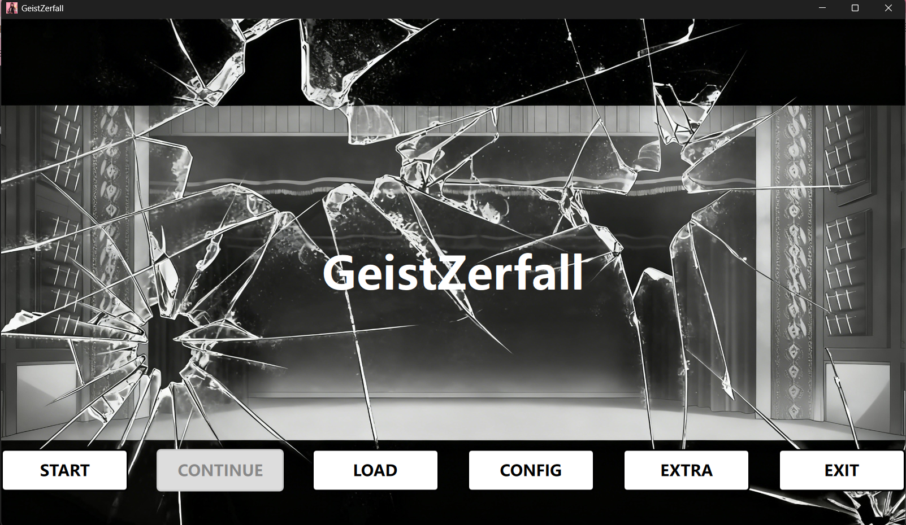
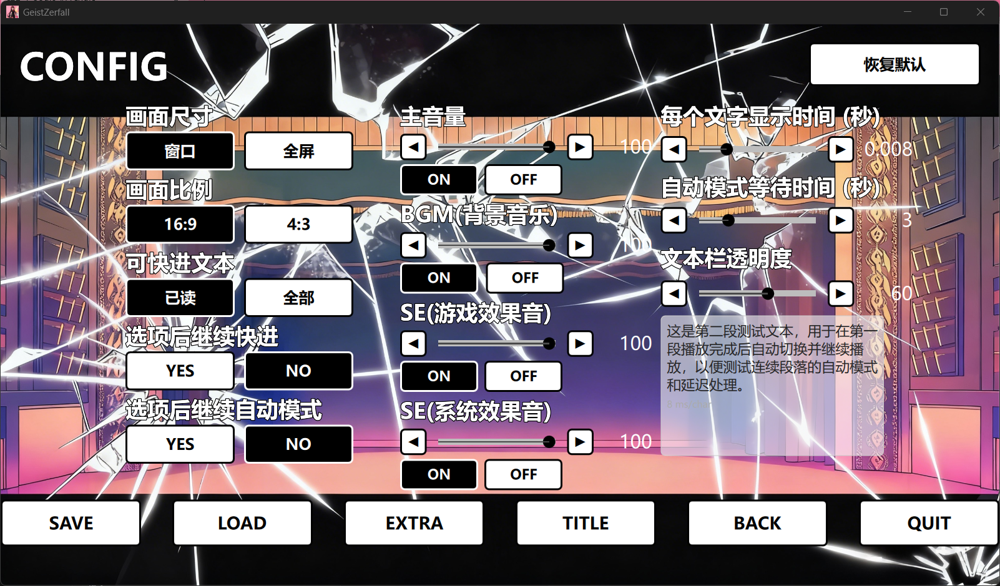
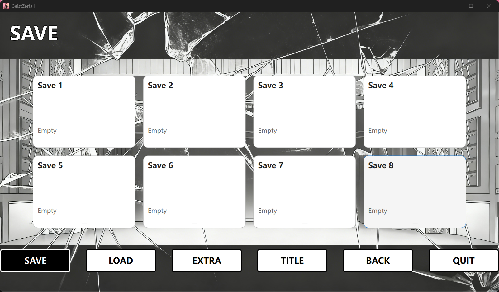
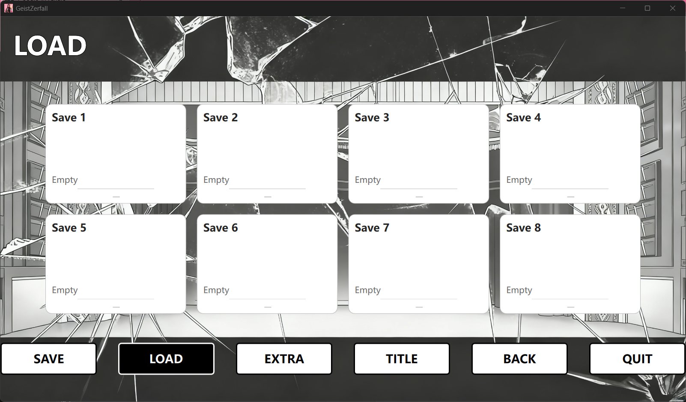
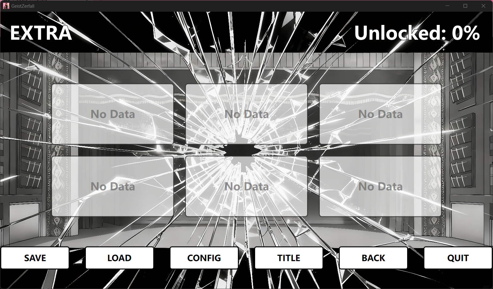
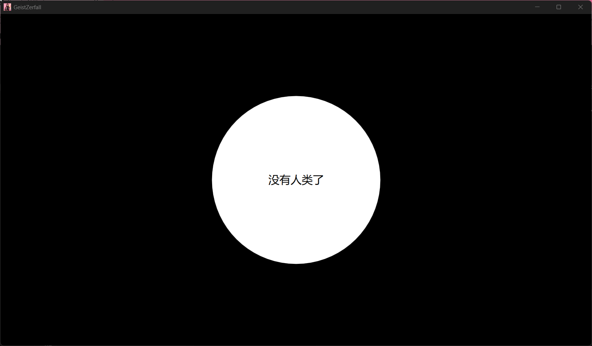
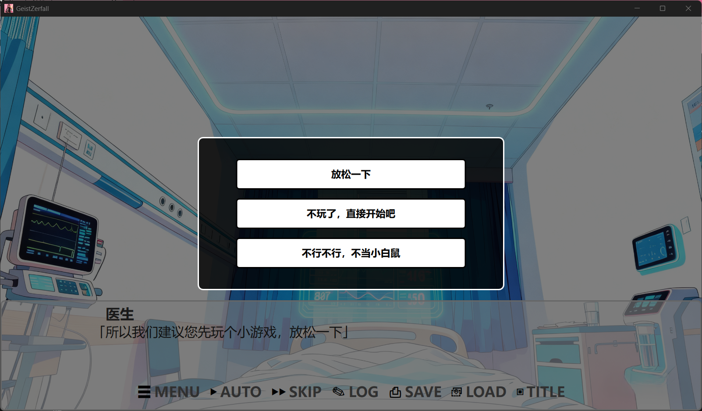


## 玩家操作说明 (Gameplay Manual)

### 操作与界面示意
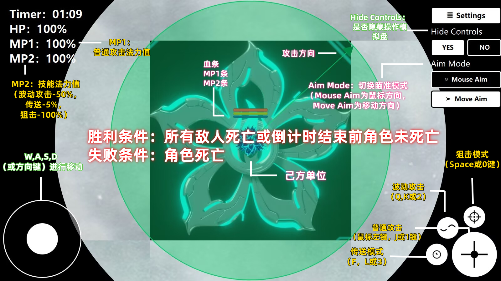
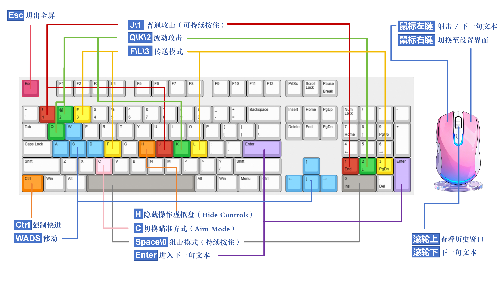

### 基本操作（键盘/按键）
*   **W / ↑**：向上移动
*   **S / ↓**：向下移动
*   **A / ←**：向左移动
*   **D / →**：向右移动
*   **F**：切换/进入/退出 传送模式（Teleport Mode）
*   **空格（Space） / J / K 等**（取决于键位绑定）：技能按键（例如狙击 / 近战等）

*注：触屏/左右摇杆与按键绑定在 `GameView.qml` 中实现，主视图会将按键映射至 `touchControls`。*

### 界面与资源 (HUD) 说明
*   **HP**：玩家生命值，UI 内用百分比显示（HP：xx%）。
*   **MP1 (Bullet CD)**：表示普通射击资源条。
    *   每次射击消耗小量资源（默认示例：`shotCost = 10`，`bulletCdMax = 3000`，约 0.33%/发），只要 `bulletCd > 0` 即可继续射击。
    *   停止射击将触发子弹资源充能（Timer 驱动）。
*   **MP2 (Laser CD)**：表示激光/技能资源条。
    *   **狙击 (snipe)** 通常消耗全部 MP2（100%）。
    *   **波 (wave)** 消耗 50% MP2。
    *   **传送 (teleport)** 会消耗约 5% MP2（触发成功后客户端扣除）。
    *   MP2 的充能由前端计时器自动恢复。

### 玩家技能（概述）

1.  **普通射击 (Shoot)**
    *   调用：`Player::shoot(px,py,dirx,diry)`
    *   子弹：`PlayerBullet`，单发直线飞行，按朝向发射。
    *   资源：消耗 MP1（按 `shotCost`），若 MP1 为 0 则无法再射击。

2.  **狙击 (Snipe / Laser)**
    *   调用：`Player::snipe(px,py,dirx,diry)`
    *   发射：同时创建 **5 条** `PlayerLaser`。
    *   角度：**0°, ±15°, ±30°**（相对朝向）。
    *   资源：触发会消耗 100% MP2（`laserCd` 归零）。
    *   额外：进入 snipe 状态（`snipeStart()`）会将视野扩大为原来的 ×2，同时把移动速度降低到 25%。切换 off 时恢复。

3.  **波 (Wave)**
    *   调用：`Player::wave(px,py,dirx,diry)`
    *   发射：先发出 **3 条向前波**（0°, +30°, -30°），随后再发出 **3 条反向波**（相反方向的 0°, ±30°），合计 6 条。
    *   资源：消耗 50% MP2（`laserCd`）。

4.  **传送 (Teleport)**
    *   调用：`Player::teleportTo(x,y)` 或切换传送模式 `toggleTeleportMode()`。
    *   资源：触发传送事件时会从 MP2 中扣除约 5%（前端机制）。
    *   进入传送模式不会自动消耗 MP2，只有执行实际 teleport 时才扣除。

### 玩家弹种简要说明
*   **PlayerBullet**：速度快的单发子弹，直线移动，到达最大距离后销毁。
*   **PlayerLaser**：慢速移动的激光/射线类，穿透视觉与持续性更强，具有 `spreadIndex` 用于视觉区分。
*   **PlayerWave**：波型类弹体，带旋转、可向前与反向发射。

---


## 敌人快速速查 (Enemy Guide)

### 敌人说明一览

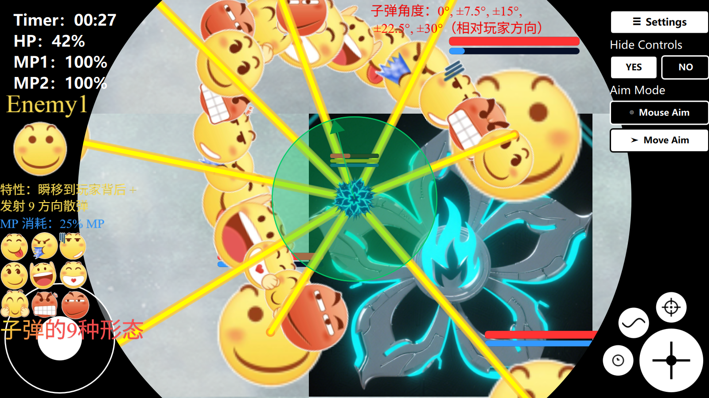
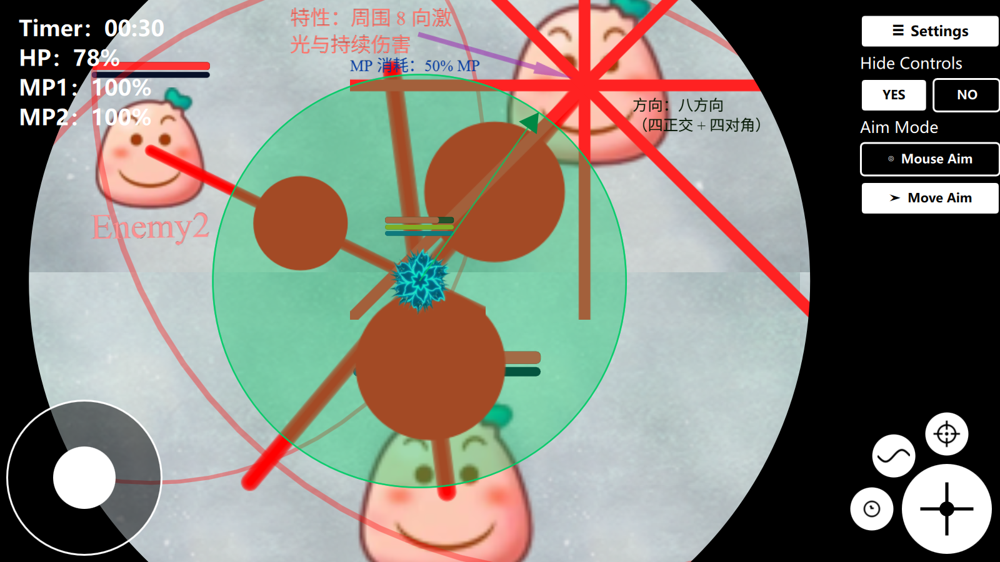
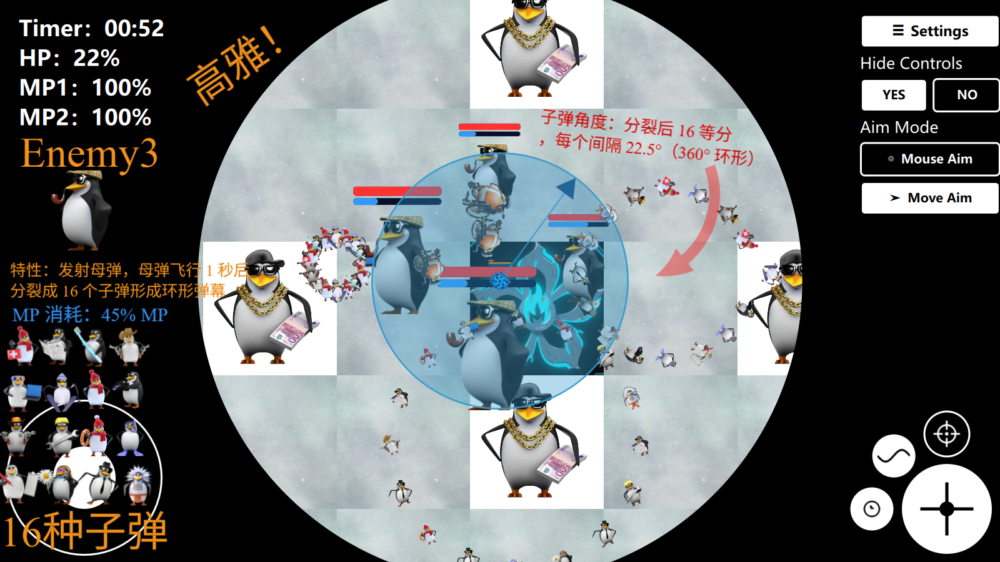
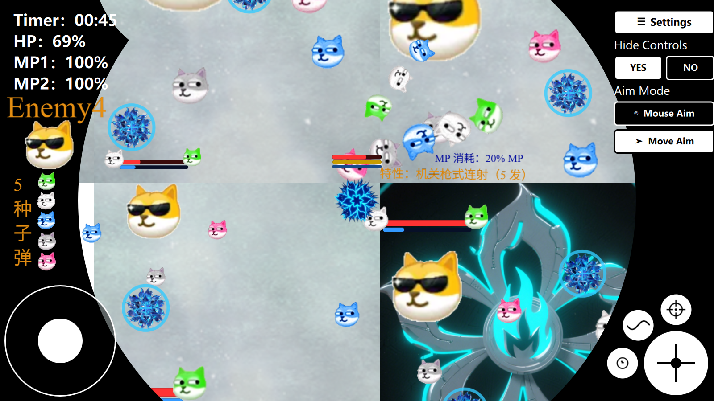
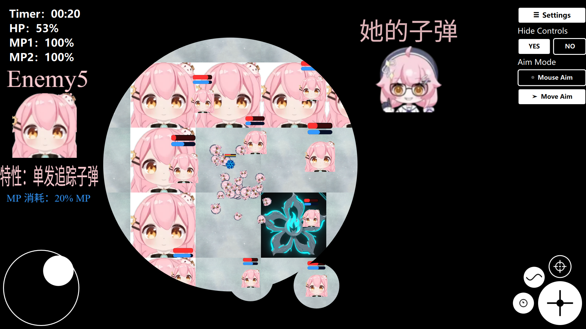
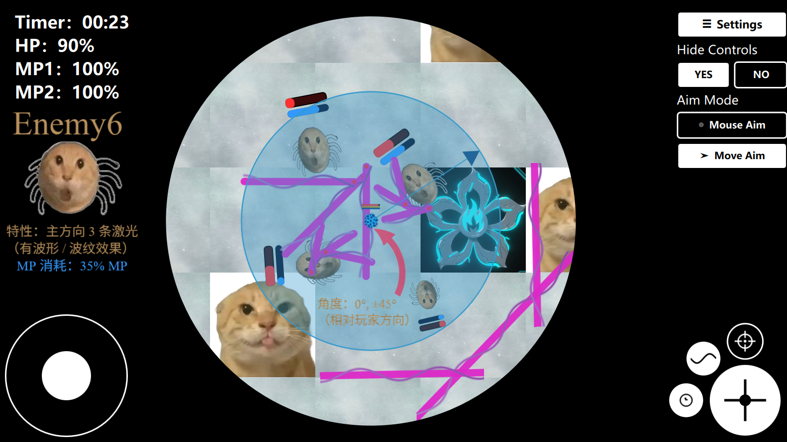
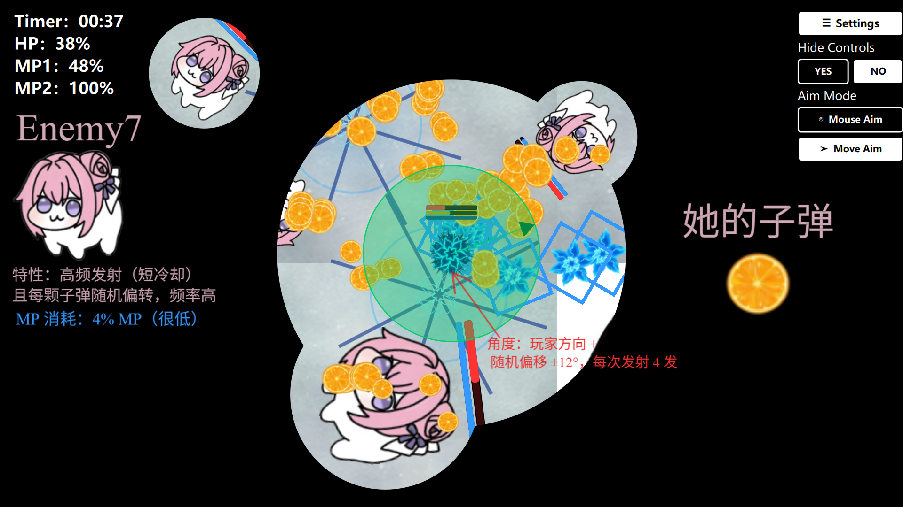

| 敌人类型 | 特性描述 | 应对提示 |
| :--- | :--- | :--- |
| **Enemy1** | **特性**：瞬移到玩家背后 + 发射 9 方向散弹。<br>**MP 消耗**：25% MP<br>**子弹角度**：0°, ±7.5°, ±15°, ±22.5°, ±30°（相对玩家方向） | 留意瞬移预警（2 秒延迟），发现预警后快速移动或用传送规避，尽量避免站位被反射到地图边缘。 |
| **Enemy2** | **特性**：周围 8 向激光与持续 aura 伤害。<br>**MP 消耗**：50% MP<br>**方向**：八方向（四正交 + 四对角） | 激光虽然方向固定但范围广，靠近边缘可能更容易被多束激光覆盖；优先移动到非激光方向的安全区，或利用短冲避开。 |
| **Enemy3** | **特性**：发射母弹，母弹飞行 1 秒后分裂成 16 个子弹形成环形弹幕。<br>**MP 消耗**：45% MP<br>**子弹角度**：分裂后 16 等分，每个间隔 22.5°（360° 环形） | 母弹飞行到指定点后会分裂，建议观察母弹轨迹并远离预计分裂位置。 |
| **Enemy4** | **特性**：机关枪式连射（5 发）。<br>**MP 消耗**：30% MP<br>**方向**：对准玩家方向，无偏移 | 短时间内连续 5 发，适合近距离打断或压制；若与敌人接近，侧移或反向快速位移避弹。 |
| **Enemy5** | **特性**：单发追踪子弹（Homing）。<br>**MP 消耗**：20% MP<br>**追踪**：会向玩家缓慢转向，具有 `trackingStrength`（默认 0.2） | 通过变向或瞬移摆脱后续追踪；尖角绕行或多次短冲可以导致子弹偏航，降低命中率。 |
| **Enemy6** | **特性**：主方向 3 条激光（有波形 / 波纹效果）。<br>**MP 消耗**：35% MP<br>**角度**：0°, ±45°（相对玩家方向） | 三路激光覆盖较大扇区，尽量位于其间隙或使用短冲/传送规避。 |
| **Enemy7** | **特性**：高频发射（短冷却）且每颗子弹随机偏转，频率高。<br>**MP 消耗**：4% MP（很低）<br>**角度**：玩家方向 + **随机偏移 ±12°**，每次发射 4 发 | 集群型敌人，连续躲避与快速移动策略有效；避免被多位敌人同时包抄。 |


## 游戏系统详解

### 1. 剧情系统 (Lore System)
采用数据驱动的 AVG 框架。剧情脚本存储在 `src/qml/window/Lore/chapters/*.json` 中。
*   **节点 (Node)**: 每个剧情片段包含背景、角色立绘、对话文本及跳转逻辑。
*   **分支 (Choices)**: 支持对话选项，可跳转至不同剧情节点或直接触发战斗。
*   **表现**: 支持角色表情差分、动态立绘位置、打字机效果及自动播放。

### 2. 战斗系统 (Battle System)
基于瓦片地图的实时射击。战斗配置存储在 `src/qml/window/Game/battles/*.json` 中。
*   **地图数据**: 定义了障碍物、玩家出生点及各种敌人的生成位置。
*   **规则**: 支持自定义胜利条件（如全灭敌人）和失败条件（如玩家死亡），以及时间限制。
*   **结果处理**: 战斗胜利或失败后可无缝跳转至指定的剧情章节。

### 3. 存档系统 (Save/Load)
*   **自动存档**: 关键节点自动保存至 `auto.dat`。
*   **手动存档**: 提供 8 个手动存档槽位 (`save1.dat` ~ `save8.dat`)。
*   **截图预览**: 存档时会自动截取当前游戏画面作为存档预览图。
*   **全局配置**: 音量、全屏设置等保存在 `system.dat`。
*   **进度管理**: `progress.dat` 记录已解锁的剧情与画廊内容。
